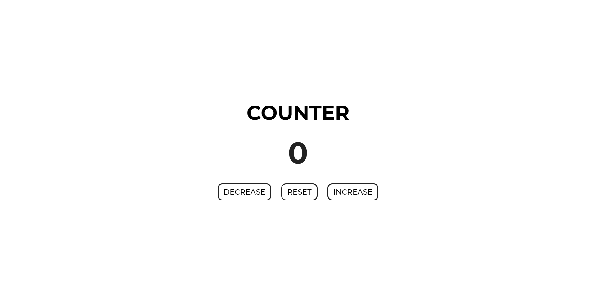

# Counter

A responsive javascript counter. The page has three different buttons that work along a counter. The first button decreases the count, the second one resets the current count and the last one increases the count.
- [Page](https://norwyx.github.io/counter/) - Final result of the project

## Built with
- [HTML5](https://developer.mozilla.org/es/docs/HTML/HTML5)
- [CSS3](https://developer.mozilla.org/es/docs/Web/CSS/CSS3)
- [JavaScript](https://developer.mozilla.org/es/docs/Web/JavaScript)
- [Github Pages](https://pages.github.com/)
